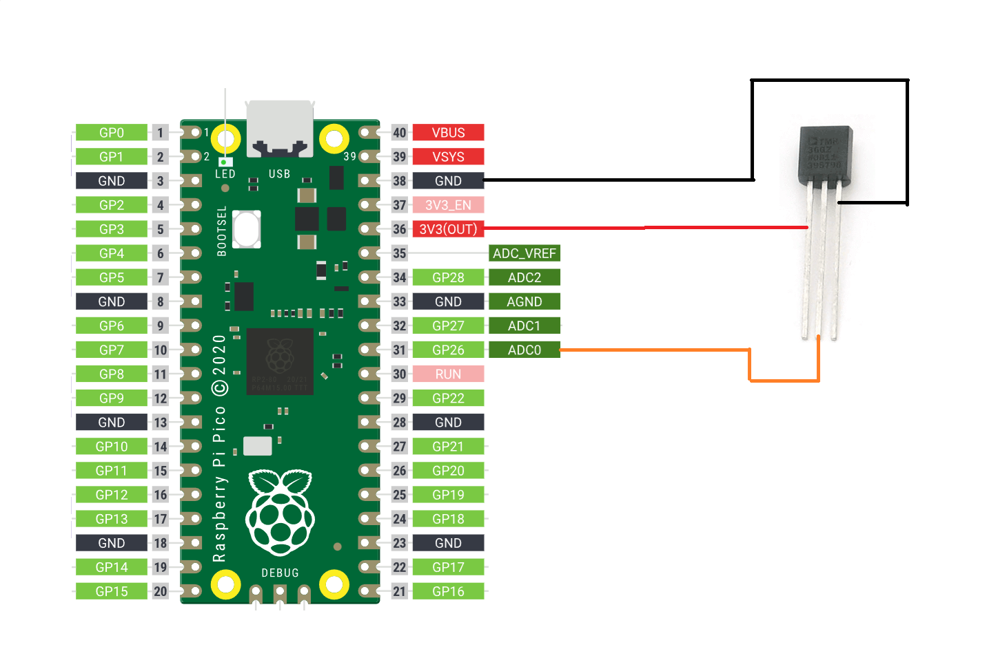
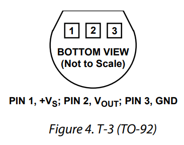
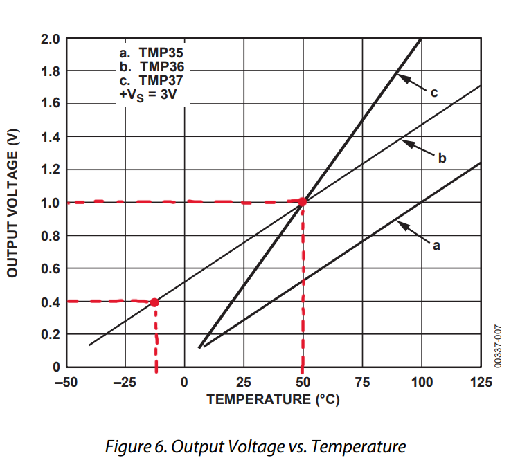

# TMP36 Tutorial using MicroPython
### Описание проекта на русском, смотри ниже ↓
### Қазақ тілінде проекттің сипаттамасы төменде көр ↓
---

This tutorial will show you how to use the [TMP36](https://www.analog.com/media/en/technical-documentation/data-sheets/tmp35_36_37.pdf) analog temperature sensor with MicroPython and Tiny2040 (Raspberry Pi Pico). The TMP36 provides a voltage output ***linearly proportional*** to the Celsius temperature, allowing us to use the equation of a line `y = mx + b` for temperature calculations.

### Hardware Required
1. Raspberry Pi Pico or Tiny2040
2. TMP36 Temperature Sensor
3. Breadboard
4. Jumper Wires

### Circuit Diagram

Using the TMP36 datasheet, we see the sensor pins as follows:

With the legs facing you, the left pin is the voltage pin, the middle pin is the output voltage, and the right pin is the ground pin.

Connect the output voltage pin to the ADC pin (GP26) of the Tiny2040. Connect the voltage pin to the 3.3V (as the datasheet specifies testing under 3V of power), and the ground pin to the GND pin of the Raspberry Pi Pico.

### Deriving the Formula for Temperature Calculation
The TMP36 sensor provides an output voltage linearly proportional to the Celsius temperature. Using the equation of a line `$y = mx + b$`, we can calculate the temperature:
- `$y$` = Temperature in Celsius
- `$m$` = Slope of the line = `$\frac{y_2 - y_1}{x_2 - x_1}$`
- `$x$` = Output voltage of the sensor
- `$b$` = Y-intercept (calculated later)

The TMP36 datasheet provides the following graph:

From the graph, we can take any two points `$(x_1, y_1)$` and `$(x_2, y_2)$` to calculate the slope. For this example, we use the points `$(1V, 50°C)$` and `$(0.4V, -12.5°C)$`.

Using the slope formula, we get:
$$
m = \frac{50 - (-12.5)}{1 - 0.4} = \frac{62.5}{0.6} \approx 104.1667
$$

Next, we calculate the y-intercept `$b$` by substituting the values of `$m$`, `$x$`, and `$y$` in the line equation. Using the point `$(1V, 50°C)$`:
$$
50 = 104.1667 \cdot 1 + b
$$
$$
b = 50 - 104.1667
$$
$$
b = -54.1667
$$

So, the temperature calculation formula is:
$$
y = mx + b
$$
$$
\text{Temperature} = 104.1667 \cdot \text{Output Voltage} - 54.1667
$$

Now that the hardest part is done, we can use this formula in the code to get the temperature in Celsius.

### Code
[main.py](main.py)

---

В этом руководстве показано, как пользоваться аналоговым датчиком температуры [TMP36](https://www.analog.com/media/en/technical-documentation/data-sheets/tmp35_36_37.pdf) с MicroPython и Tiny2040 (Raspberry Pi Pico). TMP36 выдаёт выходное напряжение ***линейно пропорциональное*** температуре по цельсию, что позволяет нам использовать уравнение линии `y = kx + b` для расчетов температуры.

### Требуемое оборудование
1. Raspberry Pi Pico или Tiny2040.
2. Датчик температуры TMP36.
3. Макетная плата
4. Провода

### Принципиальная электрическая схема

В даташите TMP36, мы видим распиновку датчика следующим образом:

Ноги датчика смотрят на нас, тогда левый контакт — это контакт питания, средний контакт — выходное напряжение, а правый контакт — контакт заземления.

Подключите вывод выходного напряжения к выводу ADC0 (GP26). Подключите контакт напряжения к 3,3 В (потому что в даташите указано тестирование при напряжении 3В), а контакт заземления — к контакту GND Raspberry Pi Pico.

### Вывод формулы для расчета температуры
Датчик TMP36 обеспечивает выходное напряжение, линейно пропорциональное температуре Цельсия. Используя уравнение линии `y = kx + b`, мы можем рассчитать температуру:
- `$y$` = температура в градусах Цельсия
- `$k$` = Наклон линии = `$\frac{y_2 - y_1}{x_2 - x_1}$`
- `$x$` = Выходное напряжение датчика
- `$b$` = точка пересечения Y (посчитаем позже)

В даташите TMP36 представлен следующий график:

Из графика мы можем взять любые две точки `$(x_1, y_1)$` и `$(x_2, y_2)$` для расчета наклона. В этом примере мы используем точки `$(1В, 50°C)$` и `$(0,4В, -12,5°C)$`.

Используя формулу наклона, получаем:
$$
k = \frac{50 - (-12.5)}{1 - 0.4} = \frac{62.5}{0.6} \approx 104.1667
$$

Затем мы вычисляем точку пересечения оси Y `$b$`, подставляя значения `$k$`, `$x$` и `$y$` в уравнение линии. Используя точку `$(1В, 50°C)$`:

$$
50 = 104.1667 \cdot 1 + b
$$
$$
b = 50 - 104.1667
$$
$$
b = -54.1667
$$

Итак, формула расчета температуры такова:
$$
y = kx + b
$$
$$
\text{Температура} = 104.1667 \cdot \text{Выходное напряжение} - 54.1667
$$

Теперь, когда самое сложное сделано, мы можем использовать эту формулу в коде, чтобы получить температуру в градусах Цельсия.

### Код
[main.py](main.py)
